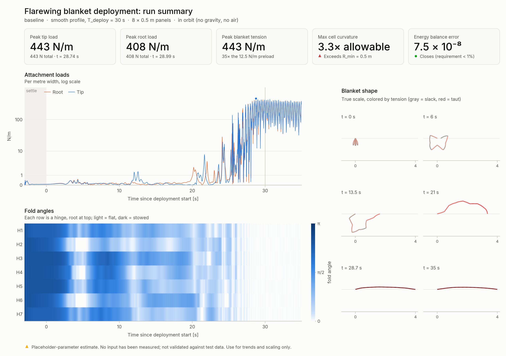
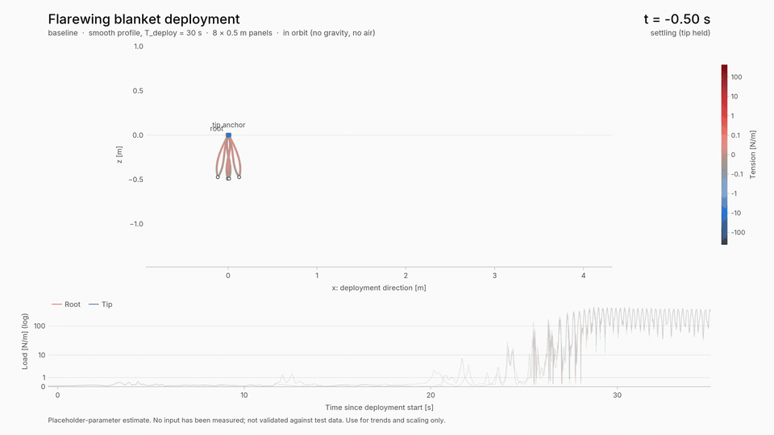
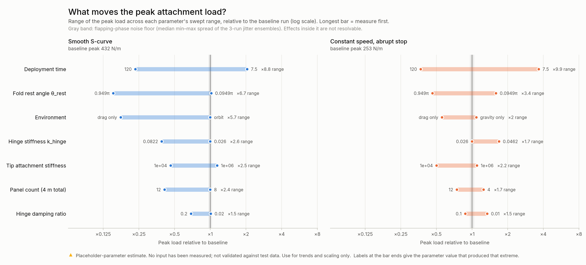

# Flarewing solar blanket deployment simulation

**BlanketSim.jl**: a first-fidelity dynamic model of a z-folded solar blanket being pulled open, written in Julia. It predicts the loads the blanket puts on the deployment mechanism (force at each attachment, including the snap when the blanket goes taut) and the loads inside the blanket (tension, fold angles, cell curvature).

> [!WARNING]
> **Every material and structural parameter is a placeholder.** Nothing in this model has been measured or validated against test data. The results show how loads *scale* with deployment speed, fold count, hinge properties and attachment compliance, and which parameters are worth measuring first. Do not use any number here as a design load.



<p align="center"></p>

## Key findings (placeholder-parameter estimates)

| Case | Peak attachment load | Peak tension | Max cell curvature | Energy balance error |
|---|---:|---:|---:|---:|
| [Baseline](results/baseline/): in orbit, smooth 30 s | 443 N/m | 443 N/m | 3.3 × allowable | 7.5 × 10⁻⁸ |
| [Abrupt stop](results/snap_worst_case/): in orbit, constant speed | 260 N/m | 260 N/m | 3.3 × allowable | 1.1 × 10⁻⁶ |
| [Ground test](results/ground_test/): gravity −z + air drag | 174 N/m | 174 N/m | 3.3 × allowable | 1.9 × 10⁻⁸ |
| [Hysteretic folds](results/hysteretic_hinge/): baseline + fold friction | 268 N/m | 268 N/m | 2.4 × allowable | 1.4 × 10⁻⁵ |

The preload tension is 12.5 N/m. Forces are per metre of width, and the totals for the 1 m wide placeholder blanket are the same numbers in N.

1. **In orbit the peak load is a whip, not a wave impact.** Unfolding releases springback energy stored in the folds and leaves the blanket flapping. Pulling it taut pumps that flapping up until the blanket snaps straight, about 35× the preload. That is why a gentle S-curve still gives a larger peak than an abrupt stop at 30 s.
2. **Deployment time is the biggest lever** (×9–10 between 7.5 s and 120 s). **Fold memory θ_rest is the biggest material unknown** (×3.4–6.7): it sets how much energy is stored at stowage.
3. **Air changes the answer.** Drag alone cuts the in-orbit peak from 432 to 76 N/m, and with gravity the ground-test load is just sag tension. A test in air will not reproduce the in-orbit snap.
4. **Cell curvature exceeds the placeholder allowable in every run.** The cause is the hinge springback moment, k_hinge (π − θ_rest) / EI ≈ 2.9 × allowable quasi-statically. Measuring the fold moment–angle curve and panel EI decides whether this is real.
5. **A more compliant tip attachment lowers peaks monotonically** (×2.5 over two decades of stiffness), which makes it a clean design lever.

Full ranking and recommended test order: **[SENSITIVITY.md](SENSITIVITY.md)**.

### Interactive briefing

**[`docs/index.html`](docs/index.html)** is a presentation-ready briefing in a single self-contained file: download it and open it in any browser, offline if needed. It has 12 full-screen sheets:
- **The case:** problem, model, verification.
- **Live demo:** scrub the deployment, with shape, tension and attachment loads moving together.
- **Results:** why the peak is a whip, the sensitivity ranking, ground vs orbit, cell curvature, what to measure first.
- **The plan:** a 14-week timeline from prototype to design loads, with stakeholders for each phase and what I would own vs ask for help with.
- **Backup:** a sheet showing where every placeholder value comes from.

A PDF of the same 12 sheets is in **[`docs/Flarewing_Blanket_Deployment_Briefing.pdf`](docs/Flarewing_Blanket_Deployment_Briefing.pdf)**.

Controls: <kbd>→</kbd>/<kbd>←</kbd> (or a presentation clicker) move between sheets, <kbd>F</kbd> toggles full screen, and <kbd>Space</kbd> plays the demo on sheet 5.

To rebuild it after new runs (it reads the local `results/*/results.jld2` files): `julia --project=. tools/build_explorer.jl`.



---

## Contents

1. [Quick start](#quick-start)
2. [What each output shows](#what-each-output-shows)
3. [Model](#model)
4. [Placeholder parameters](#placeholder-parameters)
5. [Assumptions and limitations](#assumptions-and-limitations)
6. [Verification](#verification)
7. [Numerical notes](#numerical-notes)
8. [Hooks for test data](#hooks-for-test-data)
9. [Code structure](#code-structure)

---

## Quick start

Requires Julia 1.10 or newer (developed on 1.12).

```bash
# one-time: install dependencies (first CairoMakie precompile takes several minutes)
julia --project=. -e 'using Pkg; Pkg.instantiate()'

# one run: results file, summary, all figures and the animation
julia --project=. bin/blanket_sim.jl run configs/baseline.yaml

# change any parameter from the command line
julia --project=. bin/blanket_sim.jl run configs/baseline.yaml --set deployment.T_deploy=10 --set hinge.damping_ratio=0.2

# other prepared cases
julia --project=. bin/blanket_sim.jl run configs/snap_worst_case.yaml   # constant speed, abrupt stop
julia --project=. bin/blanket_sim.jl run configs/ground_test.yaml       # gravity + air drag
julia --project=. bin/blanket_sim.jl run configs/hysteretic_hinge.yaml  # stretch goal: hysteretic folds

# parameter sweeps (use all cores; resumable, finished runs are cached)
julia --project=. -t auto bin/blanket_sim.jl sweep configs/sweep.yaml
julia --project=. bin/blanket_sim.jl sweep configs/sweep.yaml --replot   # redraw figures from the CSV

# verification tests
julia --project=. test/runtests.jl
```

Each run prints its stability estimate at startup and a one-line summary at the end:

```
[baseline] 8 panels x 0.5 m, 161 nodes, smooth profile, T_deploy = 30 s
  axial wave speed sqrt(EA/rho) = 353.6 m/s; critical dt ~ 1.580e-05 s; using dt = 7.902e-06 s (0.50 x critical)
...
baseline | peak root 408.1 N/m (408.1 N total) | peak tip 443.4 N/m (443.4 N total) | at t = 28.74 s | peak tension 443.2 N/m | max panel curvature ratio 3.3 (EXCEEDS cell bend limit) | energy balance error 7.49e-08 | PLACEHOLDER PARAMETERS, NOT VALIDATED
```

Outputs go to `results/<run_name>/`.

## What each output shows

| File | What it answers |
|---|---|
| `summary.png` | One-page dashboard: headline loads, cell check, energy closure, load trace, fold angles, shape snapshots |
| `attachment_forces.png` | Root and tip attachment load vs time (per metre width; totals in the labels), tip anchor position, and a ±60 ms zoom on the peak |
| `tension.png` | Maximum tension vs time; space-time map of tension along the blanket; full-rate (0.5 ms) window around the peak showing how the load travels |
| `fold_angles.png` | Each fold hinge's angle vs time (π = stowed, 0 = flat) against its rest angle |
| `panel_curvature.png` | Cell damage check: peak panel curvature vs the allowable 1/R_min, where along the blanket it happens, and the peak per panel |
| `energy.png` | Energy budget (work in = kinetic + stored + gravitational + dissipated), closure residual, and dissipation by mechanism |
| `deployment_filmstrip.png` | Blanket shape at true scale at nine instants, colored by tension |
| `deployment.mp4`, `deployment.gif` | Animation of the shape with the load trace revealed in sync; the peak event plays in slow motion |
| `results.jld2` | Every recorded channel and field (HDF5-based; see [reading from Python](#reading-results-from-python)) |
| `summary.txt`, `summary.json` | The one-line summary and headline metrics |

Sweep outputs (`results/sweep/`): `sensitivity.png` (ranking), `sweep_peak_attachment_force.png`, `sweep_peak_tension.png`, `sweep_curvature.png`, `sweep_runs.csv` (every run), `sweep_summary.csv` (ensemble mean/min/max), `sensitivity_table.md`. The interpretation is in [SENSITIVITY.md](SENSITIVITY.md).

## Model

### Geometry and coordinates

Planar model in the x–z plane of a **1 m wide strip** of blanket. x is the deployment direction; z is along the stowed panels and normal to the deployed blanket, so gravity along −z sags the deployed blanket (a horizontal ground test). Gravity can also point along ±x. All forces are **per metre of width**; totals are scaled by `blanket_width`.

The blanket is `n_panels` panels of length `panel_length` joined by fold hinges. The root end attaches to a fixed point; the tip end attaches to a point moved by the mechanism.

### Discretization: lumped nodal model

Each panel is split into `nodes_per_panel` segments (default 20, i.e. 25 mm). Fold hinges sit at nodes shared by two panels.

| Element | Law |
|---|---|
| Mass | areal density × tributary length, lumped at nodes |
| Axial spring-damper (each segment) | stiffness EA/ℓ; material (stiffness-proportional) damping with ratio `axial_damping_ratio` at the first axial mode of the deployed blanket |
| Panel bending (interior nodes) | torsional spring EI/ℓ̄ on the turning angle, rest angle 0 (flat); stiffness-proportional damping, ratio defined at the first free-free panel mode |
| Fold hinge (hinge nodes) | `M = −k_hinge (φ − θ_rest) − c φ̇`, with φ the fold angle (π stowed, 0 flat); damping from `hinge.damping_ratio` against one panel rotating about the hinge. Replaceable by a measured curve or a hysteretic law (see [hooks](#hooks-for-test-data)) |
| Root attachment | spring-damper (`k_att_root`, `c_att_root`) from the first node to a fixed anchor |
| Tip attachment | spring-damper (`k_att_tip`, `c_att_tip`) from the last node to the prescribed anchor |
| Gravity | on/off, direction −z, +z, −x or +x |
| Air drag | on/off; `F = −½ ρ C_d A v_n |v_n|` on the velocity normal to the local surface, A = tributary area |

Angles use `atan2(cross, dot)` and are **unwrapped** against the previous step, so folds near ±π are well defined and cannot jump by 2π. The moment is converted to nodal forces with the exact gradient of the angle.

Attachment force is reported as the spring-damper force at each end, i.e. the load on the structure.

### Deployment profiles

The tip anchor moves in a straight line from its stowed position to **flat blanket length × (1 + `preload_strain`)**:

- `smooth`: quintic S-curve, zero velocity and acceleration at both ends
- `trapezoid`: constant acceleration for `accel_fraction`·T, constant speed, constant deceleration
- `constant_then_stop`: smooth ramp-up over `start_ramp_fraction`·T, constant speed, then an **abrupt stop** at the end position (worst-case snap)

### Initial condition

A z-fold stack: fold points alternate between z = 0 and z = −h and step `stow_gap` along x, so each straight panel leans slightly and every fold keeps a small finite opening angle (no zero-radius crease). With an even panel count the tip starts on the root line. A settle phase (`T_settle`, t < 0) holds the tip while initial spring forces equilibrate, with extra numerical mass damping that is switched off at t = 0 and booked separately in the energy budget.

### Integration and energy bookkeeping

Semi-implicit (symplectic) Euler, i.e. leapfrog with half-step velocities, at a fixed step of `dt_safety` × a Gershgorin estimate of the damped explicit stability limit (printed at startup). With the defaults the axial wave speed is √(EA/ρ) = 354 m/s and the step is 7.9e-6 s (limited jointly by the axial springs and panel bending at 25 mm segments). A 38 s baseline run is 4.8 million steps and takes about 35 s on one core.

Work done by the tip anchor and dissipation by every mechanism are integrated with the same mid-step velocity the scheme uses. Kinetic energy then changes exactly by the work of all forces, so the reported **energy balance residual** measures only the O(dt²) error in the conservative potentials. It is typically below 1e-5 of the energy throughput.

Loads, tension, curvature and energies are sampled every 0.5 ms; shape and fields every 10 ms. Peaks are tracked **every time step**, so they are not missed by decimation. A ring buffer keeps a full-rate (0.5 ms) tension field around the largest attachment load.

## Placeholder parameters

Every value below is a placeholder to be replaced with measured data (`configs/baseline.yaml`).

| Parameter | Value | Basis |
|---|---|---|
| `blanket.areal_density` | 1.0 kg/m² | Rough estimate for cells + Kapton + encapsulant |
| `blanket.EA` (per m width) | 1.25e5 N/m | Kapton E ≈ 2.5 GPa × 50 µm film |
| `blanket.panel_EI` (per m width) | 1e-2 N·m | Cells + laminate, much stiffer than bare film |
| `hinge.k_hinge` (per m width) | 2.6e-2 N·m/rad | Kapton film EI ≈ 2.6e-5 N·m over ~1 mm hinge |
| `hinge.theta_rest` | 0.3π rad | Guess for fold memory; key sweep parameter |
| `hinge.damping_ratio` | 0.05 | Placeholder |
| `blanket.axial_damping_ratio` | 0.02 | Placeholder |
| `blanket.panel_bending_damping_ratio` | 0.02 | Placeholder (not in the brief; needed for panel bending) |
| `blanket.panel_length` | 0.5 m | Placeholder module length |
| `blanket.n_panels` | 8 | Placeholder |
| `blanket.blanket_width` | 1.0 m | Scale factor for total loads |
| `attachments.k_att_root`, `k_att_tip` | 1e5 N/m | Placeholder structure compliance |
| `attachments.c_att_root`, `c_att_tip` | 50 N·s/m | Placeholder (not in the brief) |
| `deployment.preload_strain` | 1e-4 | Placeholder |
| `deployment.T_deploy` | 30 s | Placeholder |
| `deployment.stow_gap` | 1 mm | Placeholder |
| `deployment.accel_fraction`, `start_ramp_fraction` | 0.2, 0.1 | Placeholder profile shapes |
| `environment.air_density`, `drag_coefficient` | 1.2 kg/m³, 1.5 | Standard air, flat-plate estimate |
| `blanket.min_cell_bend_radius` | 0.5 m | Placeholder allowable for silicon strips |

Numerical settings (not physical placeholders): `nodes_per_panel` = 20, `dt_safety` = 0.5, `T_settle` = 3 s (8 s with gravity), `settle_mass_damping` = 4 s⁻¹, `T_hold` = 5 s, `axial_stiffness_scale` = 1.

## Assumptions and limitations

- **Planar strip.** No twist, no variation across the width, no edge effects. Cells are not modelled as discrete strips: panels are uniform beams and all compliance between strips is lumped into the panel EI.
- **No mechanism.** The tip follows the prescribed motion regardless of load; attachment compliance is a linear spring-damper; there is no two-way coupling with the structure.
- **No contact.** Stack layers pass through one another, and there is no friction, stowage box or tray. In gravity-on runs the unsupported stack drops into a hanging loop during the settle phase, which is not how a real ground test is supported.
- **Hinges are points.** A hinge is a rotational spring at one node. The default law is linear; an optional hysteretic law (stretch goal) adds a loading/unloading difference, but there is no rate-dependent creep of the fold memory and no dependence on stowage time or temperature.
- **Linear, symmetric axial law.** The film carries compression in the model. Real film wrinkles instead. Compressive forces here are small and brief.
- **Linear viscous damping** with placeholder ratios for every mechanism. In orbit, damping sets how much residual flapping survives until the blanket goes taut, which dominates the peak (see [SENSITIVITY.md](SENSITIVITY.md)).
- **Air** is quadratic drag only: no added mass, which is comparable to the blanket's own mass for a 1 m wide plate in air.
- **Cell curvature next to a hinge** is governed by a boundary layer of length √(EI/T), only millimetres at high tension. The discrete curvature at the node beside a hinge is resolution-dependent in fast, high-tension events. Treat the curvature check as a qualitative flag.

## Verification

`test/test_verification.jl`: 58 checks, all passing (`julia --project=. test/runtests.jl`, about 1 minute).

| # | Test | Criterion | Result |
|---|---|---|---|
| 1 | Compound pendulum: one stiff panel pinned at one end, gravity, 2° amplitude | period within 1% of 2π√(2L/3g) | 0.08% |
| 2 | Hinge oscillator: two rigid panels joined by one hinge, free-floating, gravity off | frequency within 1% of √(k/I), I = ρL³/24 | 0.34% |
| 3 | Energy conservation: no damping, released stowed stack, tip held | drift < 0.5% | 4e-6 |
| 4 | Energy balance with prescribed motion (smooth and abrupt stop) | closure < 1% | 1e-6 and 3e-5 |
| 5 | Static tension: flat blanket stretched by a fixed tip displacement | T = EA × strain in every segment | to 1e-12 |
| 6 | Axial wave: velocity step at the tip | front speed within 5% of √(EA/ρ); mean load = ρ c v | 0.3%; 2.8% |
| 7 | Convergence of peak attachment force (fast snap-dominated case) | < 2% when segments per panel doubled and when dt halved | 0.43%; 0.006% |
| 8 | Geometry: stowed length, fold alternation, deployed end point and length | exact / within attachment deflection | pass |
| — | Hysteretic hinge: work around a closed fold cycle = released energy; deployment energy balance | 0.1%; < 1% | 0.1%; 2.6e-5 |
| — | Profiles (end points, derivatives) and the tabulated hinge-law hook | exact | pass |

## Numerical notes

**Time step.** Halving dt changes peak loads by < 0.01%.

**Mesh.** On the actual baseline configuration, the peak attachment load at 10 / 20 / 40 segments per panel is 424 / 443 / 448 N/m, so the default of 20 is converged to about 1%. The maximum curvature ratio converges similarly (3.42 / 3.30 / 3.24). The abrupt-stop case moves 240 / 261 / 247 N/m, which is inside its phase scatter (below).

**Phase sensitivity.** In the lightly damped in-orbit case, the unfolding leaves the blanket flapping, and the peak load is set by the flapping phase at the moment the blanket snaps taut. The model is deterministic: micron-scale perturbations of the initial state change nothing, because the settle phase damps them out. But anything that shifts the flapping frequency by ~1% (deployment time, mesh, settle length) can move a single run's peak by 5–15%. Sweeps therefore run every point as a three-run ensemble with T_deploy × {0.97, 1.00, 1.03} and report the mean and the band, so parameter effects can be read against that noise floor.

**Softened EA.** `axial_stiffness_scale < 1` allows larger steps for quick exploration, but it lowers wave impedance and therefore snap peaks. The startup banner, the summary line and every figure footer warn when it is not 1.

## Hooks for test data

- **Measured moment–angle curves:** set `hinge.law: tabulated` and `hinge.table_file` to a CSV of `fold_angle_rad,moment_Nm_per_m` (example: `configs/hinge_table_example.csv`). Stored energy is the exact integral of the curve, so the energy balance still closes.
- **Hysteretic hinges (stretch goal, implemented):** `hinge.law: hysteretic` with `k_elastic` and `yield_moment` (`configs/hysteretic_hinge.yaml`). It is a Jenkins element: a rest-angle spring in parallel with an elastic spring and a Coulomb slider. Small reversals are stiff, and once the slider slips the fold follows `k_hinge`. The loop area is booked as hinge dissipation, so the energy balance still closes.
- **Other laws (viscoelastic, test-fitted):** add a subtype of `HingeLaw` in `src/hinge_laws.jl` and define `hinge_moment` and `hinge_energy`. Laws with internal state also define `hinge_state_init` and `hinge_update_state`.
- **Measured mechanism motion:** pass `tip_motion = FunctionAnchor(t -> (position, velocity))` to `simulate`, e.g. an interpolated motion-capture trace.
- **Parameter fitting:** the force kernels in `src/forces.jl` are pure functions writing into caller-owned buffers, and `simulate` returns every channel, so a fitting loop can call it directly against a load-cell trace. The axial, attachment, gravity and damping kernels are dimension-generic for a later 3D version.

## Reading results from Python

`results.jld2` is an HDF5 file:

```python
import h5py
with h5py.File("results/baseline/results.jld2", "r") as f:
    t = f["channels/t"][:]
    F_tip = f["channels/F_tip"][:]          # N per metre width
    x = f["fields/x"][:]                    # Julia is column-major: shape here is (nodes, frames)
    print(f["summary_json"][()])
```

## Code structure

The brief's Python layout maps one-to-one onto a Julia package:

```
Project.toml / Manifest.toml   dependencies (pinned)
bin/blanket_sim.jl             CLI: run | sweep
configs/
  baseline.yaml                in-orbit baseline (placeholders documented inline)
  snap_worst_case.yaml         constant speed, abrupt stop
  ground_test.yaml             gravity + drag
  hysteretic_hinge.yaml        stretch goal: hysteretic folds
  sweep.yaml                   one-at-a-time sweeps with jitter ensembles
  hinge_table_example.csv      format for measured hinge curves
src/
  BlanketSim.jl                module
  config.jl                    defaults, YAML loading/validation, SimParams
  geometry.jl                  node layout, stowed and flat shapes
  profiles.jl                  tip motion profiles and anchors
  hinge_laws.jl                linear, tabulated and hysteretic hinge laws (test-data hook)
  forces.jl                    pure force kernels
  integrator.jl                stability estimate, leapfrog, energy bookkeeping, recorders
  outputs.jl                   results file, summary metrics
  theme.jl, plots.jl           figure system and animation
  sweep.jl                     sweeps, ensembles, sensitivity table
  cli.jl                       command-line handling
test/test_verification.jl      Section 6 verification tests
assets/fonts/                  Inter (SIL Open Font License)
tools/build_explorer.jl        builds docs/index.html from results (template: tools/explorer_template.html)
docs/index.html                standalone interactive explorer
results/                       committed figures, animations, CSVs (large .jld2 files are git-ignored)
```
