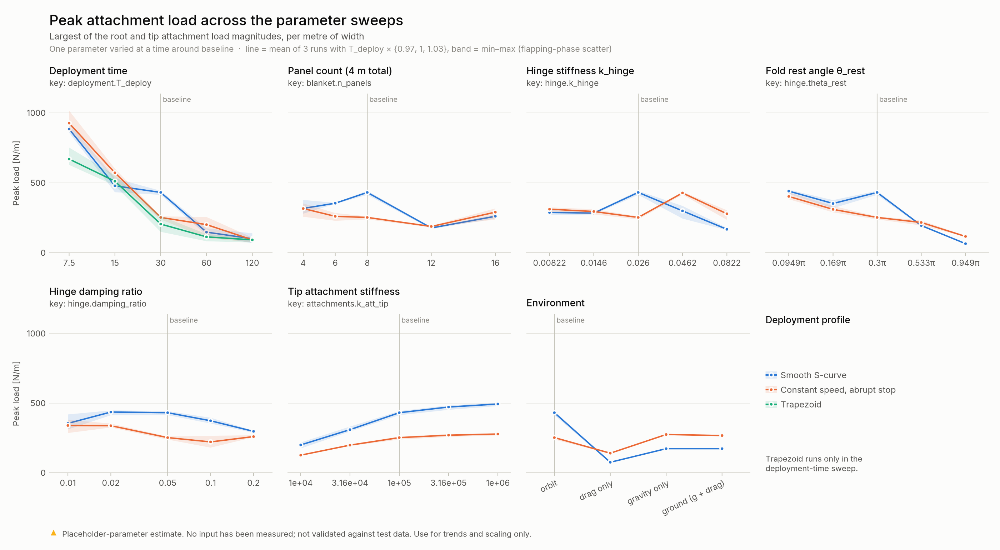
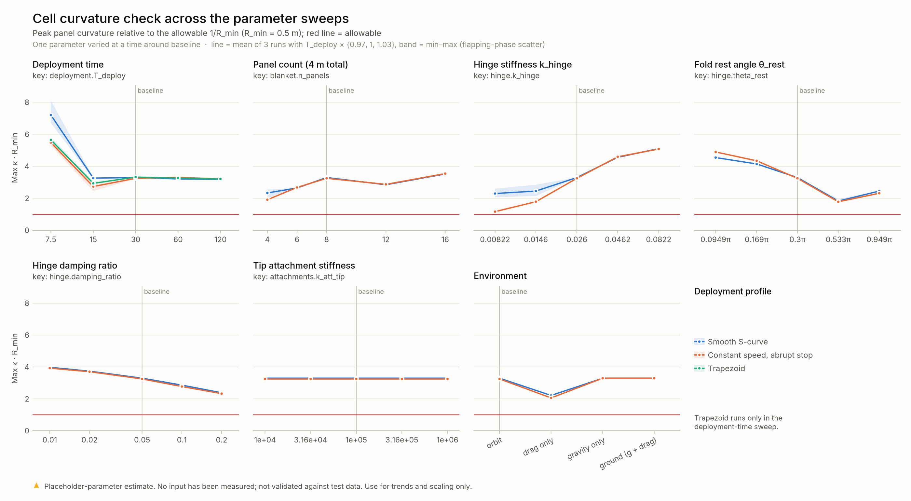

# Sensitivity summary: which parameters to measure first

> [!WARNING]
> Every input is a placeholder, and the sweep varies one parameter at a time around a placeholder baseline. The numbers below show how loads scale and which unknowns matter. They are not design loads.

## How the sweep was run

- **Sweeps.** Seven one-at-a-time sweeps around the in-orbit baseline (`configs/sweep.yaml`), each run with a smooth S-curve and with a constant-speed abrupt stop. The deployment-time sweep also includes the trapezoid profile.
- **Size.** 219 runs (189 unique) at the baseline resolution of 25 mm segments. Segment length is held fixed when panel length changes.
- **Ensembles.** Every point is the mean of three runs with T_deploy × {0.97, 1.00, 1.03}. In lightly damped runs the peak depends on the phase of residual blanket flapping when the blanket goes taut. The ensemble spread (the gray band and the shaded bands in the plots) shows how much of a difference is just that phase.
- **Metric.** Peak attachment load is the larger of the root and tip load magnitudes, per metre of blanket width. Totals scale with `blanket_width`.
- **Data.** Full results are in `results/sweep/sweep_runs.csv` and `sweep_summary.csv`. The auto-generated ranking table is `results/sweep/sensitivity_table.md`.

## Ranking

Fold change is the ratio of the highest to the lowest ensemble-mean peak across each parameter's swept range. The baseline peak is 432 N/m for the smooth profile and 253 N/m for the abrupt stop.

| Rank | Parameter (swept range) | Smooth | Abrupt stop | Direction | Phase noise |
|---:|---|---:|---:|---|---:|
| 1 | Deployment time (7.5 – 120 s) | ×8.8 | ×9.9 | Faster is worse, strongly | ±7–16% |
| 2 | Fold rest angle θ_rest (0.095π – 0.95π) | ×6.7 | ×3.4 | Weaker fold memory (θ_rest near 0) is worse | ±3–6% |
| 3 | Environment (orbit / drag / gravity / ground) | ×5.7 | ×2.0 | Air drag removes most of the in-orbit peak | ±0–1% |
| 4 | Hinge stiffness k_hinge (one decade) | ×2.6 | ×1.7 | Not monotone | ±5% |
| 5 | Tip attachment stiffness (two decades) | ×2.5 | ×2.2 | Stiffer is worse, monotone | ±3% |
| 6 | Panel count at fixed 4 m length (4 – 16) | ×2.4 | ×1.7 | Not monotone | ±4–11% |
| 7 | Hinge damping ratio (0.01 – 0.2) | ×1.5 | ×1.5 | More damping is better above 0.02 | ±4% |

Every effect in the table is well outside its phase noise.

## What drives the peak load

**In orbit, the peak is a whip, not a wave impact.** Unfolding releases the springback energy stored in the stowed folds and leaves the blanket flapping. As the tip pulls the blanket taut, rising tension raises the flapping frequency. The flapping energy grows with it: the tip does work against the oscillating tension. When the blanket snaps straight, the load arrives as a ~40 ms hump that is nearly uniform along the length. That is much slower than the 11 ms axial wave transit, so a sharp axial wave front is not what sets the peak. This is why the smooth S-curve, which barely moves at the end, still produces the largest in-orbit peak at 30 s (432 N/m vs 253 N/m for the abrupt stop).

- **Deployment time is the biggest lever and a design choice, not a material unknown.** Slower deployments leave less flapping energy (kinetic energy at the end of deployment falls from about 10 J/m at 7.5 s to 0.2 J/m at 120 s). At 60 s and longer the peak falls to about 90–200 N/m for every profile. The trapezoid profile gives the lowest peak at 7.5, 30 and 60 s (not at 15 s), and all three profiles converge by 120 s.
- **Fold memory sets how much springback energy is stored at stowage.** The stored energy per hinge is ½ k_hinge (π − θ_rest)². A fold that "remembers" its stowed shape (θ_rest → π) releases almost nothing, and the peak falls to 66 N/m. A fold that wants to lie flat (θ_rest → 0) releases the most. θ_rest and k_hinge together are the single most important material property for loads, and they are pure guesses today.
- **Air changes the answer.** Drag alone cuts the smooth-profile peak from 432 to 76 N/m, because air damps the flapping that drives the whip. With gravity, the ground-test load is the static sag tension of the deployed blanket (about 174 N/m), not a dynamic peak. **A ground test in air will not reproduce the in-orbit snap load.**
- **A compliant tip attachment helps, predictably.** Peak load rises monotonically with tip stiffness (200 → 494 N/m for 1e4 → 1e6 N/m, smooth). This is the cleanest trend in the sweep and a real design lever, e.g. deliberate compliance or damping in the tip cable.
- **Hinge damping helps modestly** (×1.5), and it lowers cell curvature too. The optional hysteretic hinge (`configs/hysteretic_hinge.yaml`) shows the same effect more strongly. Friction in the fold cuts the baseline peak from 443 to 268 N/m and the curvature ratio from 3.3 to 2.4.
- **Hinge stiffness and panel count are not monotone.** The baseline (k_hinge = 0.026, 8 panels) sits on a local maximum of flapping amplification for both. The ranking is real (the effects are far outside the phase noise), but interpolating between sweep points is not safe for these two.

## Cell curvature: exceeded for every placeholder combination

Peak panel curvature exceeds the placeholder allowable (R_min = 0.5 m) in every run: the ratio is 1.2 to 7.2 × allowable. The cause is almost quasi-static. A hinge exerts a moment k_hinge·(π − θ_rest) on the panel next to it, so the panel edge curves at

κ·R_min ≈ k_hinge (π − θ_rest) R_min / EI_panel = 0.026 × 0.7π × 0.5 / 0.01 ≈ 2.9 for the baseline

and dynamics add the rest (3.3 simulated). Accordingly, curvature scales with k_hinge (2.3 → 5.1 across the decade), is lowest for θ_rest near 0.5π (1.8, where the moment is small both stowed and deployed), falls with hinge damping (4.0 → 2.4), and is **unaffected by tip attachment stiffness**. Fast deployments (7.5 s) roughly double it.

With these placeholders, keeping the stowed springback within the allowable needs panel EI ≳ k_hinge (π − θ_rest) R_min ≈ 0.03 N·m, about three times the placeholder. Whether that is a real problem depends entirely on numbers nobody has measured yet. The curvature right next to a hinge is also resolution-sensitive in fast, high-tension events (see README, Numerical notes). Treat this as a flag, not a verdict.

## Recommended measurement priority

1. **Fold moment–angle curve at the stowed angle: k_hinge, θ_rest, and loading/unloading hysteresis, versus stowage time and temperature.** This is the largest material driver of peak load (×2.6–6.7 via stored springback energy) and the direct driver of cell curvature. It is a cheap coupon test. Feed the curve straight into `hinge.law: tabulated` or `hysteretic`.
2. **Panel bending stiffness EI and the cell allowable R_min.** These decide whether the curvature flag is real (required EI ≈ 0.03 N·m at placeholder hinge values).
3. **A deployment test with the air effect bounded: one vacuum or reduced-pressure run, or at least air-vs-shrouded comparisons.** Drag changes the in-orbit peak by ×5.7, so tests in air cannot validate the in-orbit load case without it. Gravity offload matters just as much: without it, ground loads are set by sag.
4. **Tip attachment and structure compliance** (static stiffness of the cable-truss at the tip). It moves peaks by ×2.5, monotonically, and is also the easiest design lever to tune.
5. **Damping from free-decay tests** of a partially deployed blanket and of single folds. It is a smaller effect (×1.5) but sets how much flapping survives in orbit.

Deployment speed (the largest effect, ×9–10) is a mechanism-control choice rather than a material unknown. It should be exercised in every deployment test: run several speeds with a load cell at the attachment, as planned.

## Caveats

- One-at-a-time sweeps around one placeholder baseline. Interactions are not explored, and the non-monotone responses show the baseline is not in a "typical" regime for every parameter.
- The ±3% deployment-time jitter samples timing-phase scatter only. Other small perturbations (manufacturing variation between folds, contact in the stack) are not modelled and could widen the spread.
- The gravity cases have no stowage container, contact or offload: the stack hangs as a loop before deployment.
- Air is drag only. There is no added mass, which is comparable to the blanket's own mass for a 1 m wide plate.
